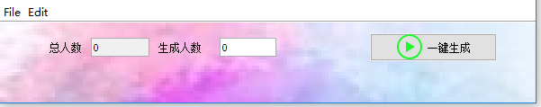

##抽奖软件（使用swing编写，exe4j 转换为exe文件）
###导入方式
选择file菜单下的导入数据，选择人员名单，格式为txt 记事本所编辑(GBK),一行一条数据
eg:
```text
张三
张婷婷
张三上
历时
王志
莉莉
达娃
```
###导出方式
选择file菜单下的导出选项，选择需要导出的目录即可导出
导出格式同样为txt（GBK）
eg:
```text
张三
张婷婷
张三上
历时
王志
莉莉
```
###效果展示


##批量生成功能

